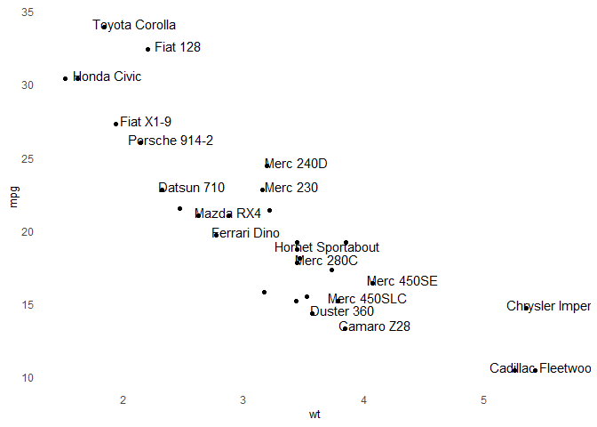

<!-- README.md is generated from README.Rmd. Please edit that file -->

# OPGgtheme

<!-- badges: start -->

<!-- badges: end -->

The goal of OPGgtheme is to provide a

## Installation

One day you might be able to install the released version of OPGgtheme
from [CRAN](https://CRAN.R-project.org) with: But you will not be able
to do this for now

``` r
install.packages("OPGgtheme")
```

And the development version from [GitHub](https://github.com/) with:

``` r
# install.packages("devtools")
devtools::install_github("hollie-rawlings/OPGgtheme")
```

## Example

This is a basic example which shows you how it works:

``` r
library(OPGgtheme)
library(ggplot2)
data=head(mtcars, 30)

# 1/ add text with geom_text, use nudge to nudge the text
g <-ggplot(data, aes(x=wt, y=mpg)) +
  geom_point() + # Show dots
  geom_text(
    label=rownames(data),
    nudge_x = 0.25, nudge_y = 0.25,
    check_overlap = T
  )
g <- g + OPGgtheme::theme_OPG_basic()
g
#> Warning in grid.Call(C_stringMetric, as.graphicsAnnot(x$label)): font family not
#> found in Windows font database

#> Warning in grid.Call(C_stringMetric, as.graphicsAnnot(x$label)): font family not
#> found in Windows font database
#> Warning in grid.Call(C_textBounds, as.graphicsAnnot(x$label), x$x, x$y, : font
#> family not found in Windows font database

#> Warning in grid.Call(C_textBounds, as.graphicsAnnot(x$label), x$x, x$y, : font
#> family not found in Windows font database

#> Warning in grid.Call(C_textBounds, as.graphicsAnnot(x$label), x$x, x$y, : font
#> family not found in Windows font database

#> Warning in grid.Call(C_textBounds, as.graphicsAnnot(x$label), x$x, x$y, : font
#> family not found in Windows font database

#> Warning in grid.Call(C_textBounds, as.graphicsAnnot(x$label), x$x, x$y, : font
#> family not found in Windows font database

#> Warning in grid.Call(C_textBounds, as.graphicsAnnot(x$label), x$x, x$y, : font
#> family not found in Windows font database
#> Warning in grid.Call.graphics(C_text, as.graphicsAnnot(x$label), x$x, x$y, :
#> font family not found in Windows font database
```


